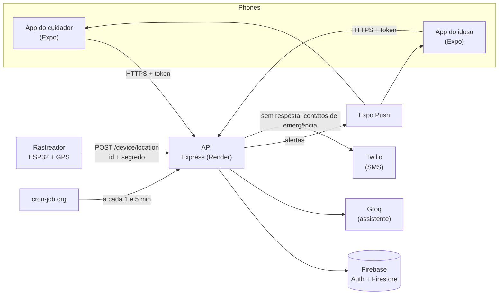

<div align="center">

  # Aurélia

  **Sistema assistivo para idosos com Alzheimer em estágio inicial e seus cuidadores**

  🔗 [Landing page publicada](https://aureliatcc1.github.io/)
</div>

---

## Sobre o projeto

O **Aurélia** é um sistema integrado que conecta, em tempo real, idosos em estágio inicial de
Alzheimer e seus cuidadores. Ele é formado por um aplicativo mobile com duas interfaces
(uma simplificada para o idoso e um painel de acompanhamento para o cuidador) e um módulo de
hardware com GPS para geofencing.

Trabalho de Conclusão de Curso (TCC) desenvolvido na ETEC Bento Quirino.

---

## Arquitetura



Os apps falam **só com a API**; apenas ela lê e escreve no Firestore (as regras do Firestore negam todo
o resto). O idoso entra no celular com um código gerado pelo cuidador; o rastreador manda a posição e a
API decide se saiu da zona segura e quem avisar. Se ninguém responder a um SOS ou a uma saída da zona
segura em 5 minutos, e o cuidador tiver escolhido "eu, depois os contatos", a API manda SMS aos
contatos de emergência. O contrato entre as partes (schemas zod) está em
`packages/shared`.

## Estrutura do monorepo

| Pasta | Conteúdo |
| --- | --- |
| `apps/mobile` | App Expo (SDK 54) com as áreas do cuidador e do idoso |
| `apps/api` | API Node.js (Express + Firebase Admin), scripts de seed e de build |
| `packages/shared` | Contrato compartilhado (schemas zod, tipos e helpers) |
| `firebase/` | Regras e índices do Firestore, configuração dos emuladores |
| `scripts/` | Simulador do rastreador (`npm run simulate:device`) |
| `render.yaml`, `deploy/` | Serviço da API no Render (plano gratuito) ou no Cloud Run |
| `docs/` | Referência da API e protocolo do rastreador |

## Como rodar o projeto

### Pré-requisitos

- [Node.js](https://nodejs.org/) 22 ou superior
- Java 11 ou superior (só para os emuladores do Firebase e `npm run test:api`)
- Expo Go no celular ou emulador configurado

### Instalação

```bash
git clone https://github.com/ThiagoLMattos/aurelia-tcc.git
cd aurelia-tcc
npm install          # uma única vez, na raiz
```

### 1. Só o app, sem servidor (modo demonstração)

Crie `apps/mobile/.env` com `EXPO_PUBLIC_API_MODE=mock` e rode `npm run dev:mobile`. O app usa um servidor
em memória; entre com `demo@aurelia.app` / `demo1234`. Detalhes em `apps/mobile/README.md`.

### 2. API local com os emuladores

```bash
cp .env.example .env     # na raiz; ajuste: FIREBASE_PROJECT_ID=demo-aurelia, USE_EMULATORS=true, LLM_PROVIDER=fake
npm run emulators        # terminal 1: Auth + Firestore
npm run dev:api          # terminal 2: API em http://localhost:3000/api/v1
npm run seed:demo -- --project demo-aurelia --emulators   # terminal 3: dados de demonstração
```

O seed imprime o login do cuidador, um código de pareamento e o id e segredo do rastreador. Com isso dá para
chamar a API (veja `docs/api.md`) e simular o rastreador sem hardware:
`npm run simulate:device -- --help`. O app não conecta nos emuladores (ele usa o Firebase Auth de verdade);
para rodar o app com a API de verdade, use um projeto Firebase próprio (próximo item).

### 3. App + API em um projeto Firebase

Preencha `.env` (API) e `apps/mobile/.env` (app) com as chaves do seu projeto, como em `.env.example`, e rode
`npm run dev:api` e `npm run dev:mobile`. No celular, `EXPO_PUBLIC_API_URL` precisa apontar para o IP do
computador na rede local.

### Testes e verificações

`npm run typecheck`, `npm run lint`, `npm test` (shared, mobile e cenários do simulador) e `npm run test:api`
(API, sobe os emuladores). O CI (`.github/workflows/ci.yml`) roda tudo isso em cada pull request.

### Referências

- Referência da API: [`docs/api.md`](docs/api.md) · Protocolo do rastreador: [`docs/device-protocol.md`](docs/device-protocol.md)
- API em produção: `Dockerfile` com `render.yaml` (Render, plano gratuito) ou `deploy/cloud-run.yaml` (Cloud Run, exige faturamento); variáveis em `.env.example`
- Build do app: perfis em `apps/mobile/eas.json`

Mais detalhes em `apps/api/README.md` e `apps/mobile/README.md`.

---

## Problema

Pessoas em estágio inicial de Alzheimer esquecem tarefas simples do dia a dia, como tomar
remédios ou lembrar em que dia da semana estão, e podem sair de casa sem avisar ninguém.
Seus cuidadores, por sua vez, vivem em estado constante de alerta, sem visibilidade real
sobre a rotina e a localização de quem cuidam, o que gera desgaste físico e emocional para
os dois lados.

## Solução

O Aurélia une as duas pontas dessa rotina em um único sistema:

- **App do idoso**: interface simplificada, com lembretes de medicação e rotina guiados por
  uma assistente de IA com quem o idoso conversa por voz (segura o botão, fala, e ela responde em voz alta).
- **Painel do cuidador**: histórico de atividades, alertas em tempo real, gestão de contatos
  de emergência e um resumo diário escrito pela assistente. Vários cuidadores da família podem
  acompanhar o mesmo idoso, por convite.
- **Módulo de geolocalização**: hardware com ESP32 e GPS que cria uma "zona segura" ao redor
  de casa e dispara um alerta imediato ao cuidador caso ela seja rompida.

## Público-alvo

- Idosos em estágio inicial de Alzheimer, que ainda têm autonomia mas precisam de apoio leve
  no dia a dia.
- Cuidadores e familiares responsáveis por essa rotina de cuidado.

## Tecnologias utilizadas

| Camada | Tecnologias |
| --- | --- |
| App mobile | React Native (Expo) |
| Backend | Node.js, Firebase |
| Inteligência artificial | Groq API |
| Alertas aos contatos de emergência | Twilio (SMS) |
| Hardware / geofencing | ESP32, GPS NEO-6M |
| Landing page | HTML5, CSS3, JavaScript |

## Equipe

| Nome | Responsabilidade |
| --- | --- |
| Pedro Isaías | Desenvolvedor do Aurélia: API (`apps/api`) |
| Pyetro Fabrício | Desenvolvedor do Aurélia: área do idoso no app e firmware do rastreador (ESP32) |
| Thiago Mattos | Desenvolvedor do Aurélia: área do cuidador no app e integração rastreador ↔ API ↔ app |
| Simone Lacerda | Orientadora |
| Tiago Jesus | Coorientador |

## Landing page

A landing page está publicada via GitHub Pages em:
**[https://aureliatcc1.github.io/](https://aureliatcc1.github.io/)**